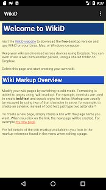
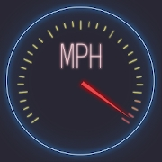
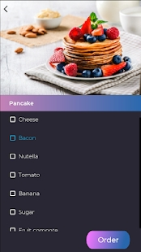
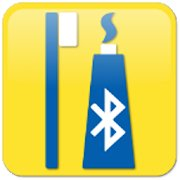
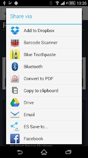

# mitchellsoft

##Consultants

###Alex Mitchell

TODO: Alex will write his blurb this week

https://www.linkedin.com/in/alxmitchell/

###Kate Mitchell

A senior software engineer, with over 13 years commercial experience, Kate kickstarted her career with a Computer Science
Degree at the University of Bristol. From there, she was accepted on IBM's "Extreme Blue" internship scheme and took a
graduate placement at their top UK development lab. She began developing in lower level languages, developing IBM's top 
z/OS transaction server, CICS, as part of the Web Services team. Kate worked with languages such as Assembler and C, as 
well as Java and C++, before discovering Python and falling in love with its features, community and incredible 
versatility.

Kate has now specialised in Python for over 10 years, and has worked large companies such as the media giant Sky, as 
well as medium sized companies and startups, in a range of sectors. She excels at back end development, such as 
integrations, large scale computations, algorithms and API development, but also has experience of full stack 
development using frameworks such as Django and can deliver front end changes when required. Her passion for clean, 
quality code is evident in all that she does, and her experience in test driven development is an asset to any project.

https://www.linkedin.com/in/mitchk1609/

##Apps

### WikiD

WikiD is a note-taking application. Write the notes in plain text, using "markup" to insert formatting, for example 
*this would be bold*, then view them with the markup turned into beautifully styled pages.

* [View in Google Play store](https://play.google.com/store/apps/details?id=uk.org.alexmitchell.wikid.android&hl=en&gl=US)
* [Download for Desktop (Windows, Linux, Mac)](http://www.mitchellsoft.co.uk/wikid/)

### MPH

 

MPH is a proprietary app, developed and used for a popular pancake house . It enables customers to customise and order breakfast 
items through an app rather than with waiting staff.

* [View in Google Play store](https://play.google.com/store/apps/details?id=uk.co.mitchellsoft.mph&hl=en&gl=US)

### Blue Toothpaste

Have you ever wanted to quickly, easily share content from one Bluetooth-enabled device to another, for example a web 
page address from your phone to your friend's tablet? With Blue Toothpaste, that's exactly what you can do.

* [View in Google Play store](https://play.google.com/store/apps/details?id=uk.co.mitchellsoft.android.bluetoothpaste&hl=en&gl=US)

##Websites

###The Baggy Soap Company

http://www.baggysoap.co.uk

### Benjamin Shepherd

http://www.benjaminshepherd.com/

images
Photo by <a href="https://unsplash.com/@nasa?utm_source=unsplash&amp;utm_medium=referral&amp;utm_content=creditCopyText">NASA</a> on <a href="https://unsplash.com/s/photos/code?utm_source=unsplash&amp;utm_medium=referral&amp;utm_content=creditCopyText">Unsplash</a>
